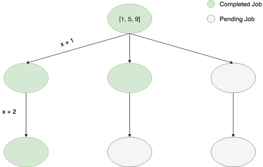
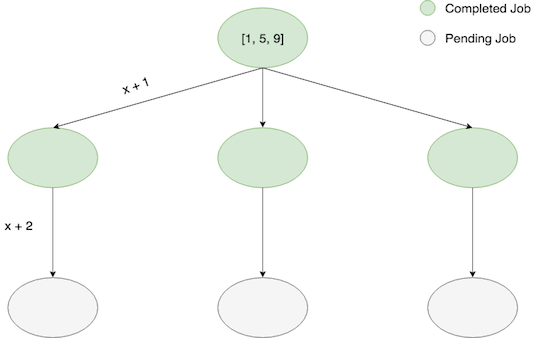

Prefect: Production Workflows
============================

Who am I?
---------

I am [Chris White](http://github.com/cicdw); I am the Tech Lead 
at [Prefect](https://www.prefect.io), a company building the next generation of workflow automation platforms for data engineers and data
scientists.  In this role, I am the core developer of our [open source engine](https://github.com/PrefectHQ/prefect)
which allows users to build, schedule and execute robust workflows.

The Problem I'm trying to solve
-------------------------------

Most teams are responsible for maintaining production workflows that
are critical to the team's mission. Historically these workflows consisted
largely of batch ETL jobs, but more recently include things such as
deploying parametrized machine learning models, ad-hoc reporting, and
handling event-driven processes.

Typically this means developers need a workflow system which can do things such as:
- retry failed tasks
- schedule jobs to run automatically
- log detailed progress (and history) of the workflow
- provide a dashboard / UI for inspecting system health
- provide notification hooks for when things go wrong

among many other things.  We at Prefect like to think of a workflow system as
a technical insurance policy - you shouldn't really notice it much when 
things are going well, but it should be maximally useful when things go wrong.

Prefect's goal is to build the next generation workflow system.  Older systems
such as [Airflow](https://medium.com/the-prefect-blog/why-not-airflow-4cfa423299c4) and Luigi are limited 
by their model of workflows as slow-moving, regularly scheduled,
with limited inter-task communication.  Prefect, on the other hand, embraces
this new reality and makes very few assumptions about the nature and requirements of
workflows, thereby supporting more dynamic use cases in both data engineering
and data science.

How Dask helps
--------------

Prefect was designed and built with Dask in mind.  Historically, workflow systems
such as [Airflow](https://airflow.apache.org/) handled _all_ scheduling, of both
workflows _and_ the individual tasks contained within the workflows. This pattern introduces a number of problems:
- this puts an enormous burden on the central scheduler (it is scheduling _every single action_ taken in the system)
- it adds non-trivial latency to task runs
- in practice, this limits the amount of dynamicism workflows can have
- it also tends to limit the amount of data tasks can share, as all information is routed through the central scheduler
- it requires users to have an external scheduler service running to run their workflows at all!

Instead, Prefect handles the scheduling of _workflows_, and lets Dask
handle the scheduling and resource management of _tasks_ within each workflow.  This
provides a number of benefits out of the box:

- **Task scheduling:** Dask handles all task scheduling within a workflow, allowing Prefect to incentivize smaller tasks which Dask schedules with millisecond latency
- **"Dataflow":** because Dask handles serializing and communicating the appropriate information between Tasks, Prefect can support "dataflow" as a first-class pattern
- **Distributed computation:** Dask handles allocating Tasks to workers in a cluster, allowing users to immediately realize the benefits of distributed computation with minimal overhead
- **Parallelism:** whether running in a cluster or locally, Dask provides parallel Task execution off the shelf

Additionally, because Dask is written in pure Python and has an active open source community,
we can very easily get feedback on possible bugs, and even contribute to improving the software ourselves.

To achieve this ability to run workflows with many tasks, we found that Dask's [Futures interface](https://docs.dask.org/en/latest/futures.html)
serves us well.  In order to support dynamic tasks (i.e., tasks which spawn other tasks), we rely on Dask [worker clients](http://distributed.dask.org/en/latest/task-launch.html?highlight=worker_client).  We have also occasionally experimented with [Dask Queues](http://distributed.dask.org/en/latest/api.html?highlight=sharing%20futures#distributed.Queue) to implement more complicated behavior such as future-sharing and resource throttling, but are not currently using them (mainly for design reasons).

Pain points when using Dask
---------------------------

Our biggest pain point in using Dask has largely revolved around the ability (or lack
thereof) to share futures between clients.  To provide a concrete example, suppose we start with a 
list of numbers and, using [`client.map`](https://distributed.readthedocs.io/en/latest/api.html#distributed.Client.map)
twice, we proceed to compute `x -> x + 1 -> x + 2` for each element of our list.  When using only dask primitives and a single client,
these computations proceed asychronously, meaning that the final computation of each branch
can begin without waiting on the other middle computations, as in this schematic:

However, in Prefect, we aren't simply passing around Dask futures created from a single `Client` - when a [`map` operation](https://docs.prefect.io/guide/core_concepts/mapping.html#prefect-approach) occurs, the dask futures are actually created by a `worker_client` and attached to a Prefect `State` object.
*Ideally*, we would leave these futures unresolved at this stage so that computation can proceed as above.  However, because 
it is non-trivial to share futures between clients we must `gather` the futures with this same client, making
our computation proceed in a "breadth-first" manner: 

This isn't the worst thing, but for longer pipelines it would be very nice to have the faster branches
of the pipeline proceed with execution so that final results are produced earlier for inspection.

Technology we use around Dask
----------------------------

Our preferred deployment of Prefect Flows uses [dask-kubernetes](https://github.com/dask/dask-kubernetes)
to spin up a short-lived Dask Cluster in Kubernetes.  

Otherwise, the logic contained within Prefect Tasks can be essentially arbitrary;
many tasks in the system interact with databases, GCP resources, AWS, etc.

Links
-----

- [Prefect Repo](https://github.com/PrefectHQ/prefect)
- [Prefect on Dask Example](https://docs.prefect.io/guide/tutorials/dask-cluster.html)
- [Dask-Kubernetes](https://kubernetes.dask.org)
